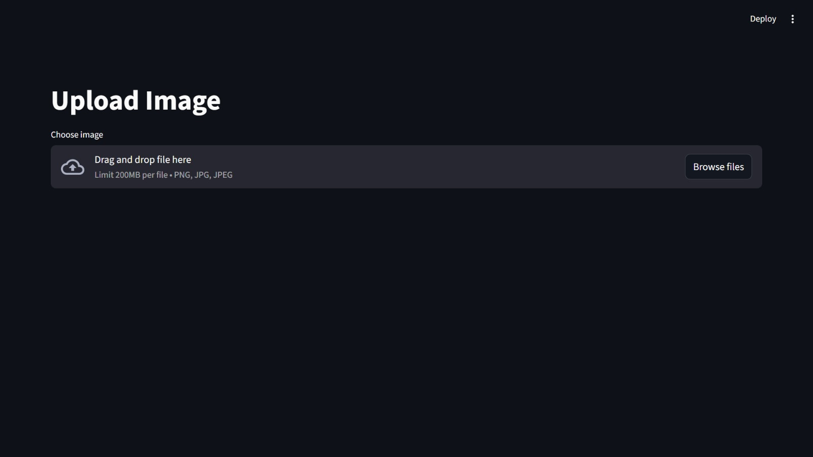
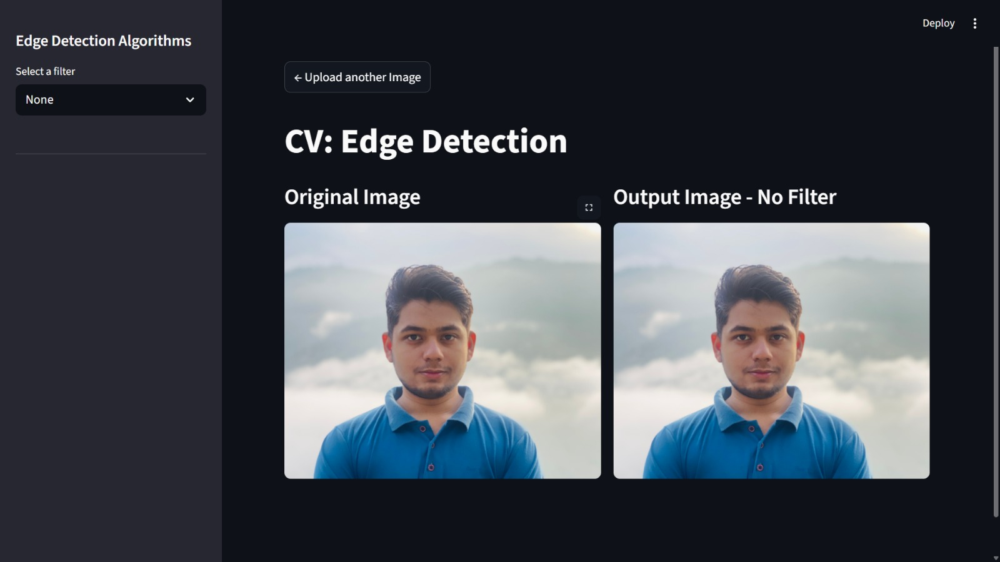
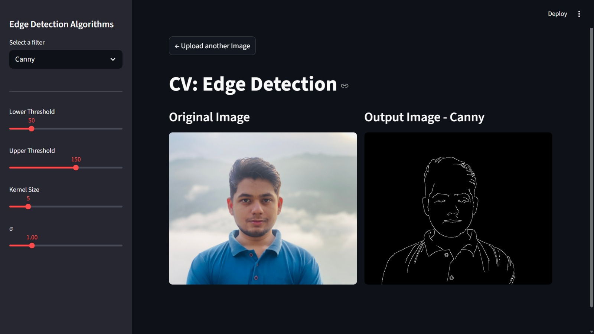
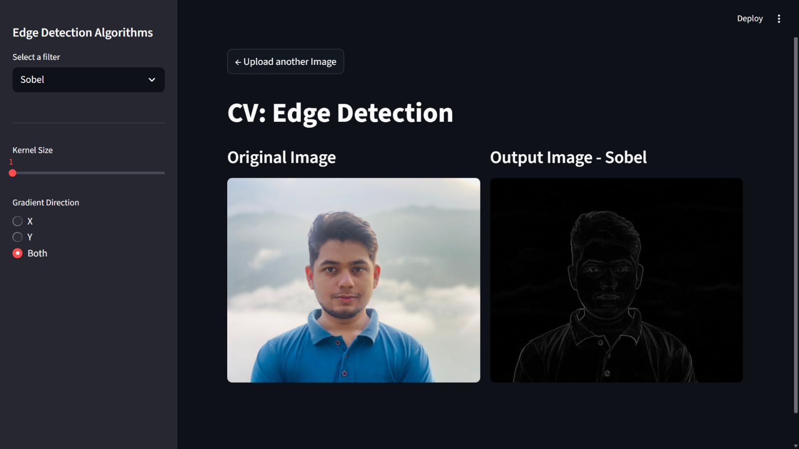
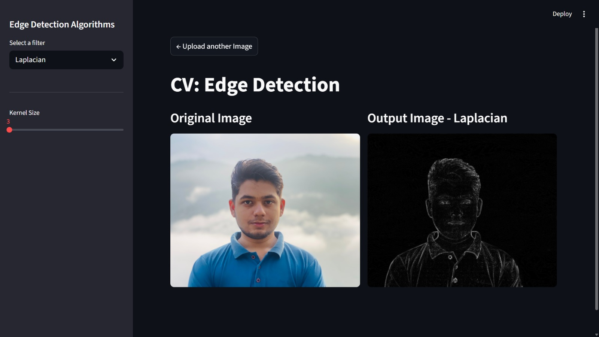

<h1 style="text-align: center;">CV: Edge Detection</h1>

  <strong>GUI for applying Canny, Sobel, and Laplacian filters to images</strong> 
  Built with Streamlit for visualizing the effect of a few filters.

<h2>Project Description</h2>

This project provides a user-friendly interface for applying edge detection algorithms to images. Users can upload an image and interactively apply <strong>Canny</strong>, <strong>Sobel</strong>, and <strong>Laplacian</strong> filters with adjustable parameters. The results are displayed side-by-side with the original image for easy comparison.

<h2>Setup and Installation</h2>
<ol>
  <li>Clone the repository:
    <pre><code>git clone https://github.com/zaidbzaheer2/cv-edge-detection.git </code></pre>
  </li>
  <li>Navigate to the project directory:
    <pre><code>cd cv-edge-detection</code></pre>
  </li>
  <li>Create a virtual environment (optional):
    <pre><code>python -m venv .venv
.venv/Scripts/activate # On Windows (Powershell)
.venv\Scripts\activate # On Windows (CMD)
source .venv/bin/activate  # On Linux</code></pre>
  </li>
  <li>Install dependencies:
    <pre><code>pip install -r requirements.txt</code></pre>
  </li>
</ol>

<h2>Running the Application</h2>
<pre><code>streamlit run main.py</code></pre>

Once launched, the app will open in your browser. Upload an image and choose an edge detection filter from the sidebar to begin.

<h2>Core Features</h2>
<ul>
  <li>Upload any image and preview it instantly</li>
  <li>Apply Canny, Sobel, or Laplacian filters</li>
  <li>Adjust parameters interactively:
    <ul>
      <li><strong>Canny:</strong> Lower/Upper thresholds, kernel size, sigma</li>
      <li><strong>Sobel:</strong> Kernel size, gradient direction</li>
      <li><strong>Laplacian:</strong> Kernel size</li>
    </ul>
  </li>
  <li>Side-by-side comparison of original and processed images</li>
  <li>Responsive layout with sidebar controls</li>
</ul>

<h2>Screenshots</h2>
 

  Built with Python, Streamlit, and OpenCV By Zaid Bin Zaheer

